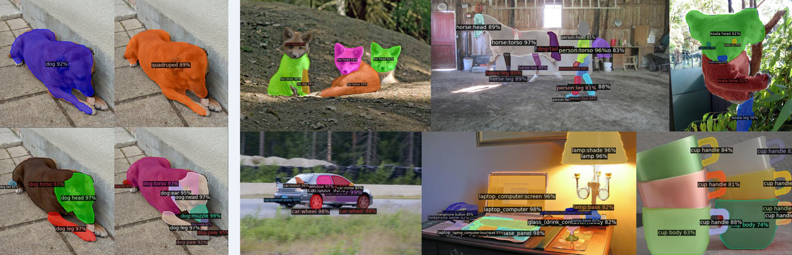

# Going Denser with Open-Vocabulary Part Segmentation



## Installation

See [installation instructions](INSTALL.md).

## Getting Started

See [Preparing Datasets](datasets) and [Preparing Models](models).

See [Getting Started](GETTING_STARTED.md) for demo, training and inference.


## Model Zoo

We provide a large set of baseline results and trained models available for download in the [Model Zoo](MODEL_ZOO.md).


## License

[](https://opensource.org/licenses/MIT)

The majority of this project is licensed under a [MIT License](LICENSE). Portions of the project are available under separate license, detailed in [Acknowledge](ACKNOWLEDGE.md).


## Citation

If you use VLPart in your research or wish to refer to the baseline results published here, please use the following BibTeX entries:

```BibTeX

@article{peize2023vlpart,
  title   =  {Going Denser with Open-Vocabulary Part Segmentation},
  author  =  {Sun, Peize and Chen, Shoufa and Zhu, Chenchen and Xiao, Fanyi and Luo, Ping and Xie, Saining and Yan, Zhicheng},
  journal =  {arXiv preprint arXiv:2023.00000},
  year    =  {2023}
}
```

## Acknowledgement

Code is based on many wonderful projects, listed in [Acknowledge](ACKNOWLEDGE.md).
